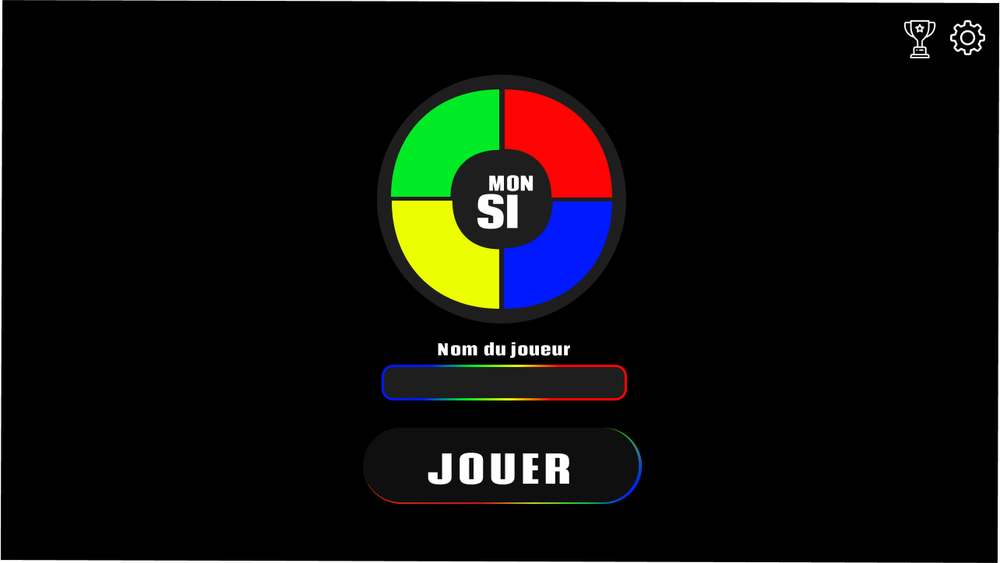

# Jeu du MonSi (simon)

Le but de ce projet est de développer un jeu du simon exclusivement coté front-end.
Pour ce faire, nous allons utiliser vanillaJS avec la librairie Tone.js

## Les bases

Codage d'un simple simon avec :

    1) Jeu solo
    2) 4 sons randoms (4 couleurs les représentant)
    3) Affichage du score
    4) ScoreBoard dans le localStorage

## à faire pour aller plus loin:

    [x] Niveau de difficulté
       - Découverte (2 touches, rapidité faible, 1 couleur ajoutée à chaque round)
       - Normal (4 touches, rapidité normal, 1 couleur ajoutée à chaque round)
       - Difficile (6 touches, rapidité qui augment en fonction des tours, 2 couleurs ajoutées à chaque round)
       - Hardcore (8 touches, rapidité qui augment en fonction des tours, 3 couleurs ajoutées à chaque round, nombre de couleurs ajouté par tours qui augmente)
    1. + de couleur
    2. des vrais musiques

## A régler

[x] PointerEvent
[] Keyboard Virtual
[] Responsive HOME

## Annexes

Tone.js : [npm](https://www.npmjs.com/package/tone?activeTab=readme)
& [Github](https://github.com/Tonejs/Tone.js#readme)

[Figma](https://www.figma.com/file/jfC4Mki0acMdv3nY3NKxov/SImon?type=design&node-id=0%3A1&mode=design&t=GF7XgWvC7lOaUf9G-1)
